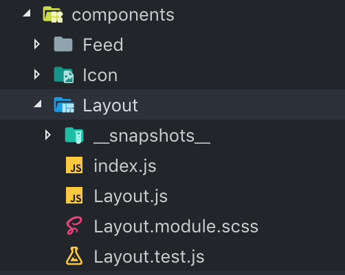

## Templating 설계

### template literal 활용과 함수로직 분리 

- react 에서 component 처럼 분리해 보면 어떨까?



- carouselHeader, carouselMain, carousel(index) 로 나누고, carousel이 header와 main template를 포함한다
- carousel(index)
  - carouselHead
  - carouselMain
- 실제 데이터를 받아 templating을 작동할 때는 carousel 만 이용하자.
- 각 컴포넌트는 데이터를 받아 template에 데이터를 주입시켜서 완성된 html 텍스트를 반한하는 함수가 되야 한다.

### Sudo code

#### 1. 컴포넌트 

```js
// carouselHeader 
const carouselHeader = data => 
`
  <ul class="carousel__header">
    ${data} //
  </ul>
`
export default carouselHeader;

// --------------------------------------------------

// carouselMain
const carouselMain = data => 
`
  <div class="carousel__main">
    ${data} //
  </div>
`
//----------------------------------------------------

// carousel
import carouselHeader from './carouselHeader.js';
import carouselMain from './carouselMain.js';

const carousel = data =>
  `
  <div class="carousel">
    ${carouselHeader(data)}
    ${carouselMain(data)}
  </div>
`;

export default carousel;

```

#### 2. 템플릿을 만드는 함수

```js
const makeDataToHtml = (data, templateFunc) => templateFunc(data);
```

